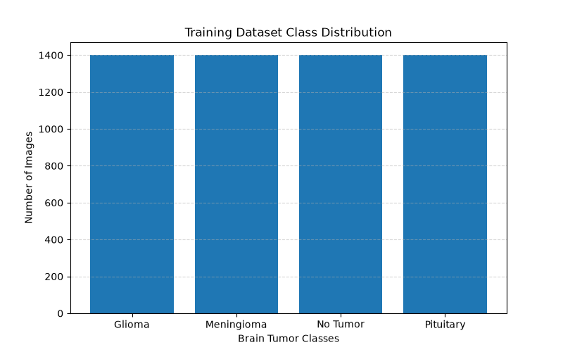
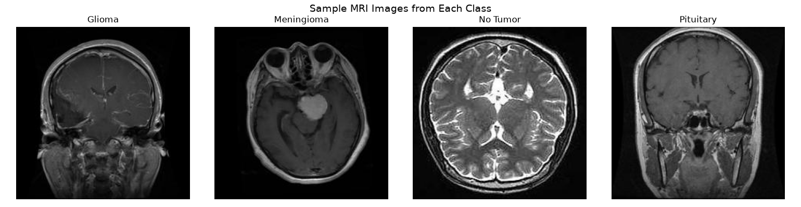
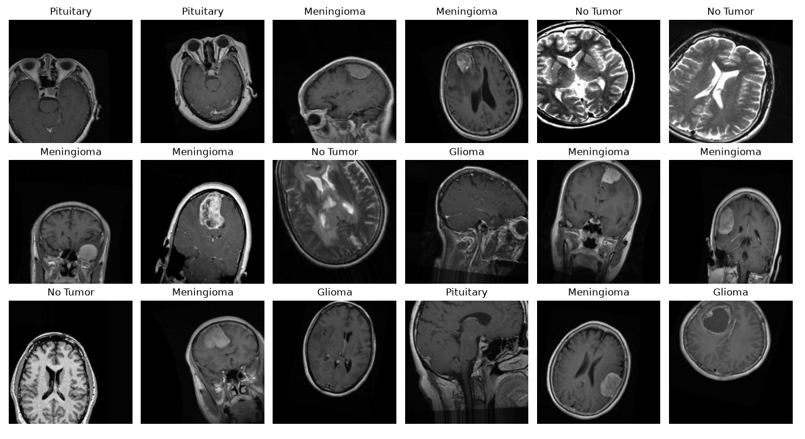

# 🧠 Brain Tumor MRI Classification using Deep Learning

<p align="center">

</p>

<p align="center">


</p>

---

# 📌 Project Overview

This project focuses on automatic brain tumor classification using MRI scans and Deep Learning techniques.

The goal is to assist healthcare professionals by providing an AI-powered system capable of identifying different tumor categories from MRI images.

The project includes:

* Dataset Analysis
* Image Visualization
* Data Preprocessing
* CNN Model Development
* Transfer Learning
* Model Evaluation
* Deployment Pipeline

---
## 📚 Dataset

This project uses the **Brain Tumor MRI Dataset** publicly available on Kaggle.

### Dataset Information

- **Dataset Name:** Brain Tumor MRI Dataset
- **Source:** Kaggle
- **Author:** Mohibur Rahman Rifat
- **Classes:**
  - Glioma
  - Meningioma
  - Pituitary
  - No Tumor

### Dataset Link

🔗 https://www.kaggle.com/datasets/mohiburrahmanrifat/brain-tumor-mri

> **Note:** The dataset is not included in this repository due to its size and Kaggle's distribution policy. Please download it from the official Kaggle page and place it inside the `dataset/` directory before running the project.

# 🎯 Objectives

* Analyze MRI brain tumor dataset
* Understand class distribution
* Perform image preprocessing
* Train CNN-based models
* Improve performance using Transfer Learning
* Evaluate model accuracy
* Build an end-to-end deployment-ready solution

---

# 🧬 Brain Tumor Classes

| Class      | Description                            |
| ---------- | -------------------------------------- |
| Glioma     | Tumor originating in brain glial cells |
| Meningioma | Tumor arising from meninges            |
| Pituitary  | Tumor affecting pituitary gland        |
| No Tumor   | Healthy MRI image                      |

---

# ✨ Features

✅ Dataset Analysis

✅ MRI Visualization

✅ Class Distribution Analysis

✅ Data Validation

✅ Data Preprocessing

✅ CNN Training Pipeline

✅ Transfer Learning Support

✅ Evaluation Metrics

✅ Model Saving & Loading

✅ Deployment Ready

---

# 🏗️ Project Architecture

```text
MRI Dataset
      │
      ▼
Data Analysis
      │
      ▼
Preprocessing
      │
      ▼
CNN Model
      │
      ▼
Transfer Learning
      │
      ▼
Evaluation
      │
      ▼
Prediction
      │
      ▼
Deployment
```

# 📂 Project Structure

```text
BrainTumorProject
│
├── app
│   └── main.py
│
├── dataset
│   ├── Training
│   ├── Validation
│   └── Testing
│
├── models
│
├── outputs
│   ├── class_distribution.png
│   ├── sample_mri_images.png
│   ├── augemented_images.png
│
├── scripts
│   └── dataset_analysis.py
│
├── requirements.txt
├── README.md
└── LICENSE
```

# 📊 Dataset Statistics

| Property     | Value                      |
| ------------ | -------------------------- |
| Dataset Type | MRI Images                 |
| Classes      | 4                          |
| Image Format | JPG / PNG                  |
| Domain       | Medical Imaging            |
| Task         | Multi-Class Classification |

---

# 🛠️ Tech Stack

<p align="center">

</p>

### Libraries Used

* NumPy
* Pandas
* Matplotlib
* Seaborn
* OpenCV
* TensorFlow
* Keras
* Scikit-Learn

---

# 🚀 Installation

```bash
# Clone Repository
git clone https://github.com/SunkesulaMasthan/Projecto

# Move to Project Directory
cd BrainTumorProject

# Create Environment
conda create -n braintumor python=3.11

# Activate Environment
conda activate braintumor

# Install Dependencies
pip install -r requirements.txt
```

---

# ▶️ Run Dataset Analysis

```bash
python scripts/dataset_analysis.py
```

---

# 📷 Output Gallery

## Class Distribution



## Sample MRI Images



## MRI Samples



---

# 📈 Project Progress

| Module             | Status         |
| ------------------ | -------------- |
| Project Setup      | ✅ Completed    |
| Dataset Analysis   | ✅ Completed    |
| Visualization      | ✅ Completed    |
| Data Validation    | ✅ Completed    |
| Data Preprocessing | 🔄 In Progress |
| CNN Model          | 🔄 In Progress |
| Transfer Learning  | ⏳ Planned      |
| Deployment         | ⏳ Planned      |

---

# 🔬 Future Enhancements

* Advanced Data Augmentation
* EfficientNet Training
* Vision Transformer Models
* Explainable AI (Grad-CAM)
* FastAPI Backend
* Streamlit Dashboard
* Docker Deployment
* Cloud Deployment

---

# 🤝 Contributing

Contributions are welcome.

1. Fork the repository
2. Create a feature branch
3. Commit changes
4. Push changes
5. Create a Pull Request

---
## 🙏 Acknowledgements

This project uses the **Brain Tumor MRI Dataset** created and shared by **Mohibur Rahman Rifat** on Kaggle.

Dataset:
https://www.kaggle.com/datasets/mohiburrahmanrifat/brain-tumor-mri

Special thanks to the dataset author for making this resource publicly available for research and educational purposes.

# 👨‍💻 Author

**Sunkesula Masthan**

B.Tech Computer Science & Engineering

AI • Machine Learning • Deep Learning

GitHub: https://github.com/SunkesulaMasthan

---

# 📜 License

This project is licensed under the MIT License.

---

<p align="center">
⭐ If you found this project useful, please consider giving it a star.
</p>

<p align="center">
Made with ❤️ by Masthan S~
</p>
